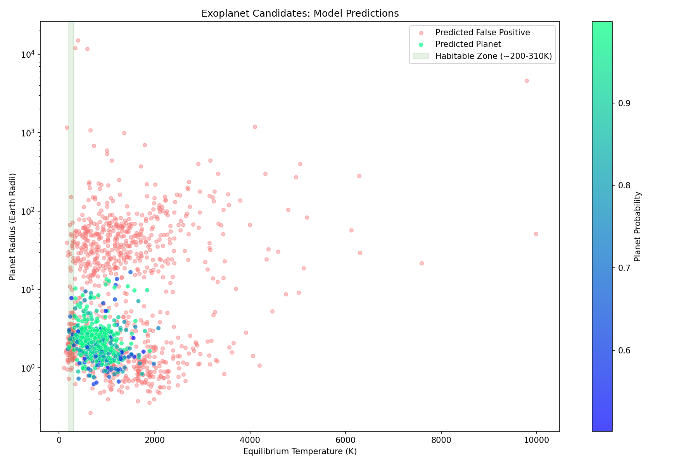

# Exoplanet Transit Classifier

A machine learning pipeline that classifies Kepler Objects of Interest
as confirmed exoplanets or false positives using transit signal and
stellar properties.

## Overview

NASA's Kepler Space Telescope observed ~200,000 stars for four years,
detecting periodic brightness dips that could indicate orbiting planets.
Not every signal is a real planet — eclipsing binary stars, instrumental
noise, and stellar variability produce similar signatures. This project
builds a classifier that distinguishes real planets from false positives
using 9 physical features extracted from Kepler's observations.

## Results

- **Accuracy:** 91.3%
- **ROC AUC:** 0.968
- **Planet Precision:** 86%, when the model says "planet," it's right
  86% of the time
- **Planet Recall:** 86%, the model finds 86% of real planets



## Key Findings

- Transit depth (`koi_depth`) and orbital period (`koi_period`) are
  the strongest predictors, consistent with astrophysical expectations
- No single feature cleanly separates the classes — the model's power
  comes from combining all 9 features simultaneously
- The model's errors concentrate in the moderate transit depth range
  where planet and eclipsing binary signatures overlap
- SHAP analysis confirms the model learned physically meaningful
  patterns rather than arbitrary correlations

## Dataset

Kepler Exoplanet Search Results from
[Kaggle](https://www.kaggle.com/nasa/kepler-exoplanet-search-results).
~10,000 Kepler Objects of Interest with pre-extracted transit and
stellar features.

Download `cumulative.csv` and place it in the `data/` directory.

## Tech Stack

Python, pandas, scikit-learn, matplotlib, seaborn, SHAP

## Project Structure
```
exoplanet-classifier/
├── data/                  # cumulative.csv goes here
├── notebooks/
│   ├── 01_eda.ipynb           # Exploratory data analysis
│   ├── 02_preprocessing.ipynb  # Feature engineering and pipeline
│   ├── 03_modeling.ipynb       # Model training and comparison
│   ├── 04_evaluation.ipynb     # Tuning and evaluation metrics
│   └── 05_visualization.ipynb  # Hero plot, SHAP, error analysis
├── .gitignore
├── requirements.txt
└── README.md
```

## How to Run
```bash
git clone https://github.com/GitWorkingTime/exoplanet-classifier.git
cd exoplanet-classifier
python -m venv venv
source venv/bin/activate  # or venv\Scripts\activate on Windows
pip install -r requirements.txt
```

Download the dataset from Kaggle and place `cumulative.csv` in the
`data/` folder. Then open the notebooks in order.

## What I Learned

- Feature engineering matters more than model selection, log
  transformations on skewed features improved model performance
  significantly
- Evaluation metrics beyond accuracy are essential — with imbalanced
  classes, F1 score and precision-recall curves give a more honest
  picture than accuracy alone
- SHAP explanations connect machine learning to domain knowledge,
  verifying that the model uses astrophysically meaningful patterns
  builds trust in its predictions